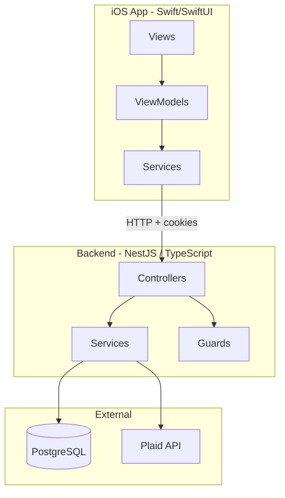
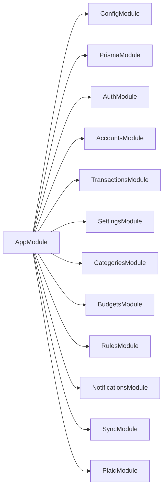
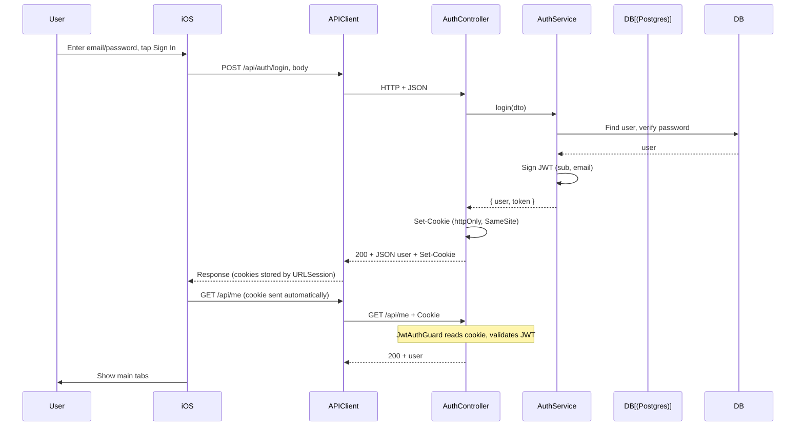
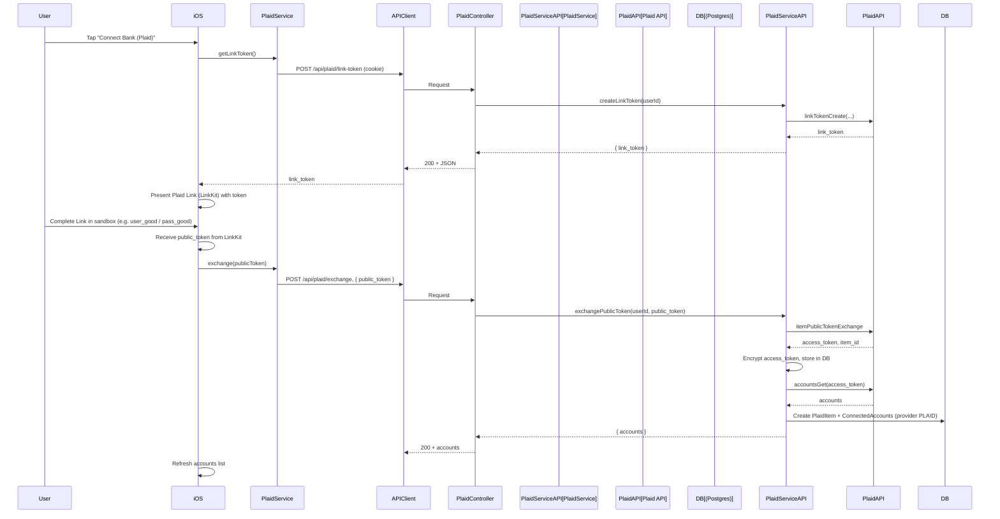
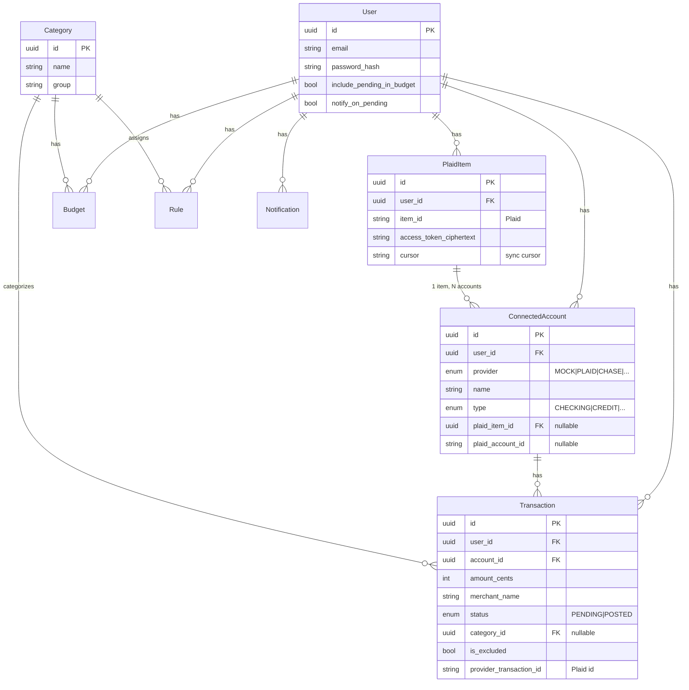
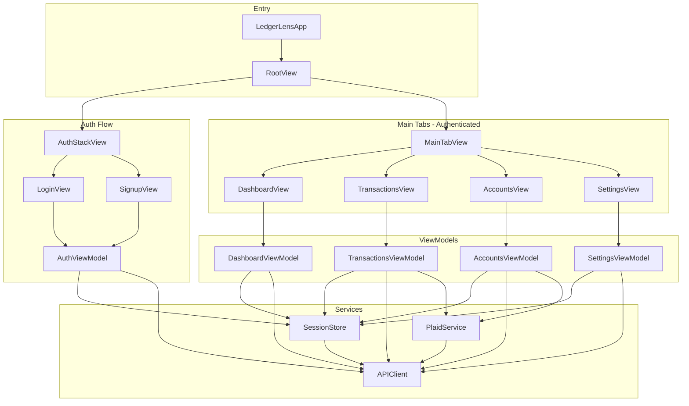
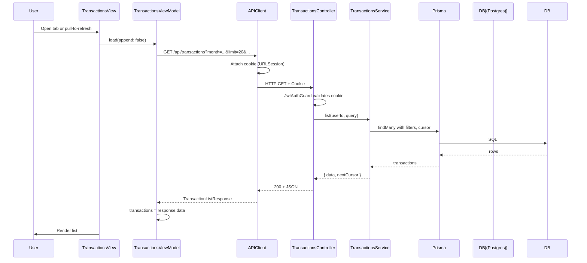

# Fundimo System Design

High-level architecture, data flow, and UML-style diagrams for the API and iOS app.

---

## 1. High-Level Architecture

- **iOS app**: Swift/SwiftUI. Views bind to ViewModels; ViewModels call Services (e.g. `APIClient`, `PlaidService`). All API calls go over HTTP with cookies.
- **Backend**: NestJS. Controllers handle routes; `JwtAuthGuard` protects most routes; Services contain business logic and talk to Postgres (Prisma) and Plaid.
- **Data**: PostgreSQL holds users, accounts, transactions, categories, rules, budgets, notifications. Plaid holds bank linkage and transaction sync (sandbox or live).

---

## 2. Backend Module Structure

- **ConfigModule**: Loads `apps/api/.env`; provides `ConfigService` globally.
- **PrismaModule**: Provides `PrismaService` for DB access.
- **AuthModule**: Login, signup, logout, JWT issue/validate, `GET /me`. Uses httpOnly cookie for JWT.
- **AccountsModule**: List accounts, mock-link (MOCK provider).
- **TransactionsModule**: List (paginated), update (category, is_excluded).
- **SettingsModule**: Get/patch user settings (include_pending_in_budget, notify_on_pending).
- **CategoriesModule**: List categories.
- **BudgetsModule**, **RulesModule**, **NotificationsModule**, **SyncModule**: Domain features.
- **PlaidModule**: Link token, exchange public token, sync transactions (Plaid API + encrypted storage).

All API routes are under the global prefix **`/api`** (set in `main.ts`).

---

## 3. API Routes Overview

| Method | Path | Auth | Purpose |
|--------|------|------|---------|
| POST   | /api/auth/signup     | No  | Register; sets httpOnly cookie |
| POST   | /api/auth/login      | No  | Login; sets httpOnly cookie |
| POST   | /api/auth/logout     | No  | Clear cookie |
| GET    | /api/me              | Yes | Current user (validates cookie) |
| GET    | /api/accounts        | Yes | List connected accounts |
| POST   | /api/accounts/mock-link | Yes | Add MOCK account |
| GET    | /api/transactions    | Yes | List (query: month, accountId, status, q, cursor, includeExcluded) |
| PATCH  | /api/transactions/:id | Yes | Update category / is_excluded |
| GET    | /api/settings        | Yes | User settings |
| PATCH  | /api/settings        | Yes | Update settings |
| GET    | /api/categories      | Yes | List categories |
| POST   | /api/plaid/link-token | Yes | Get Plaid Link token |
| POST   | /api/plaid/exchange  | Yes | Exchange public token; create PlaidItem + ConnectedAccounts |
| POST   | /api/plaid/sync      | Yes | Sync transactions from Plaid |

Protected routes use **JwtAuthGuard**: JWT is read from the **httpOnly cookie** (name from `AUTH_COOKIE_NAME`), validated with `JWT_SECRET`, and the payload (`sub`, `email`) is attached to the request.

---

## 4. Authentication Flow

- **Login**: iOS sends credentials to `POST /api/auth/login`. Backend returns JWT in an **httpOnly** cookie and a JSON user. iOS does not read the token; the system stores the cookie and sends it on subsequent requests.
- **Session check**: On launch, iOS calls `GET /api/me` with the cookie. If the guard validates the JWT, the app shows the main UI; if 401, it shows login.
- **Protected calls**: Every request to a guarded route (accounts, transactions, plaid, etc.) sends the same cookie; `JwtStrategy` extracts the JWT from the cookie and attaches the user payload to the request.

---

## 5. Plaid Link Flow (Sandbox)

- **link-token**: iOS requests a link token from the backend; backend calls Plaid’s `linkTokenCreate` and returns the token. No secrets are sent to the client.
- **Link UI**: iOS uses LinkKit to show Plaid’s UI; user completes sandbox (or real) bank link; LinkKit returns a **public_token**.
- **exchange**: iOS sends the public_token to `POST /api/plaid/exchange`. Backend exchanges it for an access_token, encrypts and stores it (PlaidItem), fetches accounts from Plaid, and creates ConnectedAccount rows. Response is the list of accounts only (no tokens).
- **sync**: User can tap Sync; iOS calls `POST /api/plaid/sync`. Backend uses stored (decrypted) access tokens and Plaid’s transactions/sync API to update local transactions.

---

## 6. Data Model (Simplified)

- **User**: One-to-many with accounts, transactions, PlaidItems, budgets, rules, notifications.
- **PlaidItem**: One per Plaid “item” (one bank connection); holds encrypted access_token and sync cursor; one-to-many ConnectedAccounts.
- **ConnectedAccount**: Either MOCK (no Plaid) or PLAID (linked to a PlaidItem and optional plaid_account_id).
- **Transaction**: Belongs to user and account; optional category; can be excluded from budget; provider_transaction_id used for Plaid deduplication.

---

## 7. iOS App Structure

- **RootView**: Reads `SessionStore.state` (unknown / authenticated / unauthenticated). Shows loading, auth stack, or main tabs.
- **SessionStore**: Owns session state; calls `GET /api/me` on launch; provides login/signup/logout and forwards API calls through `APIClient`. Cookies are managed by `URLSession` (no manual cookie handling).
- **APIClient**: Single `baseURL` (e.g. `http://127.0.0.1:3000/api`); all requests send cookies; decodes JSON and maps errors (e.g. 401 → SessionStore can force logout).
- **PlaidService**: Thin wrapper over `APIClient` for `/api/plaid/link-token`, `/api/plaid/exchange`, `/api/plaid/sync`. Used by AccountsViewModel (link) and TransactionsViewModel (sync).
- **Views**: SwiftUI; each tab has a View and a ViewModel; ViewModels call services and expose `@Published` state for the views.

---

## 8. Request Flow (Example: List Transactions)

Same pattern for other list/update endpoints: ViewModel calls APIClient with path and query/body; Guard validates JWT from cookie; Controller delegates to Service; Service uses Prisma and returns DTOs.

---

## 9. Technology Choices (Brief)

| Layer | Technology | Why |
|-------|------------|-----|
| Backend | NestJS (TypeScript) | Structure (modules, guards, DI), good fit for APIs and middleware (cookies, validation, filters). |
| API auth | JWT in httpOnly cookie | No token in JS/localStorage; cookie sent automatically; SameSite reduces CSRF. |
| DB | PostgreSQL + Prisma | Relational data (users, accounts, transactions); Prisma gives typed client and migrations. |
| iOS | SwiftUI + Swift | Native app; ViewModels + Services keep API and state logic out of views. |
| Plaid | LinkKit (iOS) + Plaid Node SDK (API) | Official SDKs; token exchange and storage stay on backend; encryption for access tokens. |

---

## 10. File Roles (Quick Reference)

| Area | Key files | Role |
|------|-----------|------|
| API entry | `apps/api/src/main.ts` | Load env, create app, global prefix `/api`, CORS, cookie parser, filters, pipes, listen. |
| API wiring | `apps/api/src/app.module.ts` | Imports all feature modules; ConfigModule + PrismaModule. |
| Auth API | `auth.controller.ts`, `auth.service.ts`, `jwt.strategy.ts`, `auth.guard.ts` | Login/signup/logout/me; JWT from cookie; guard for protected routes. |
| Plaid API | `plaid.controller.ts`, `plaid.service.ts`, `plaid.config.ts` | link-token, exchange, sync; env validation; encryption. |
| Data | `prisma/schema.prisma` | Models and relations; migrations apply to Postgres. |
| iOS entry | `LedgerLensApp.swift`, `RootView.swift` | App entry; root view switches on SessionStore state. |
| iOS auth | `SessionStore.swift`, `AuthViewModel.swift`, `LoginView.swift` | Session state; login/signup; cookie sent via APIClient. |
| iOS API | `APIClient.swift`, `PlaidService.swift` | All HTTP to backend; Plaid endpoints. |
| iOS main UI | `MainTabView.swift`, `*View.swift`, `*ViewModel.swift` | Tabs; each screen has View + ViewModel calling APIClient/PlaidService. |

This document reflects the current system; for OAuth redirect and production deployment (domain, Universal Links), see the project README and any OAuth/domain plan.
